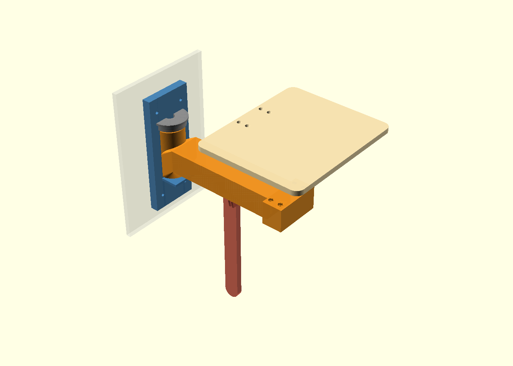
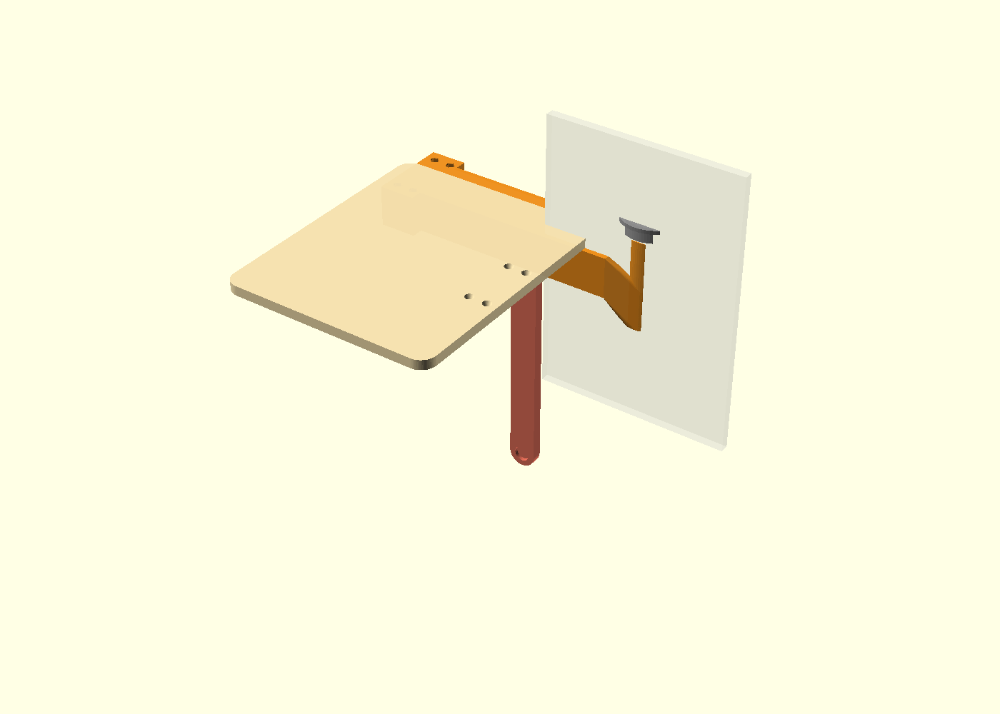
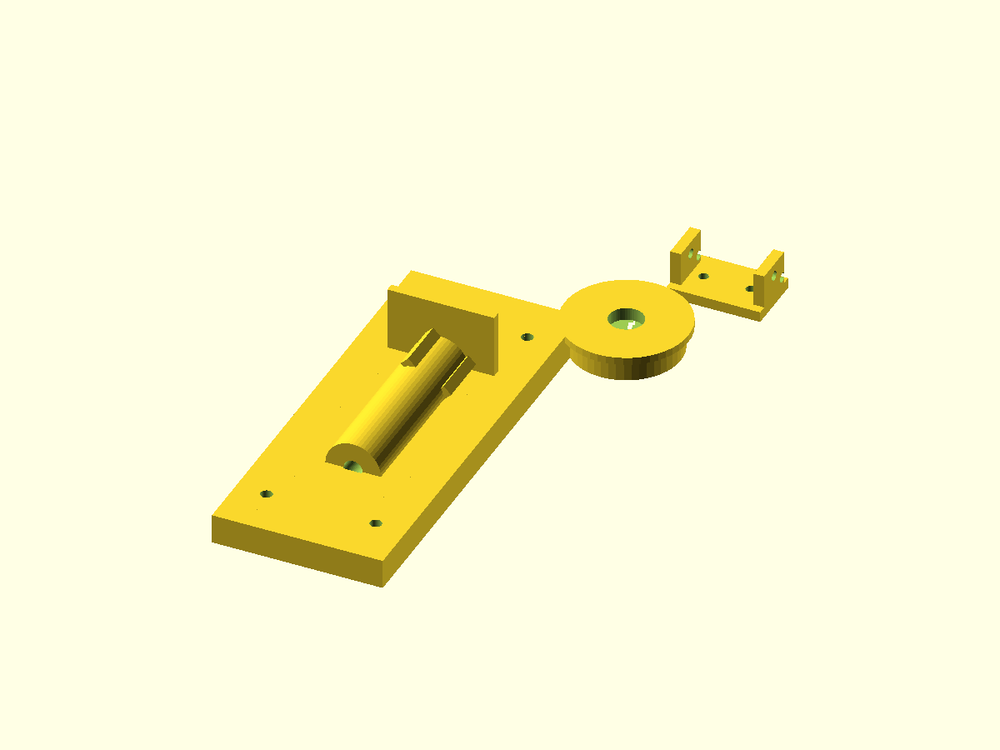
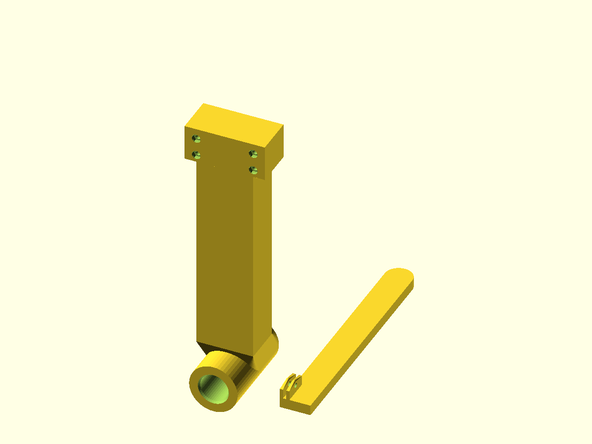
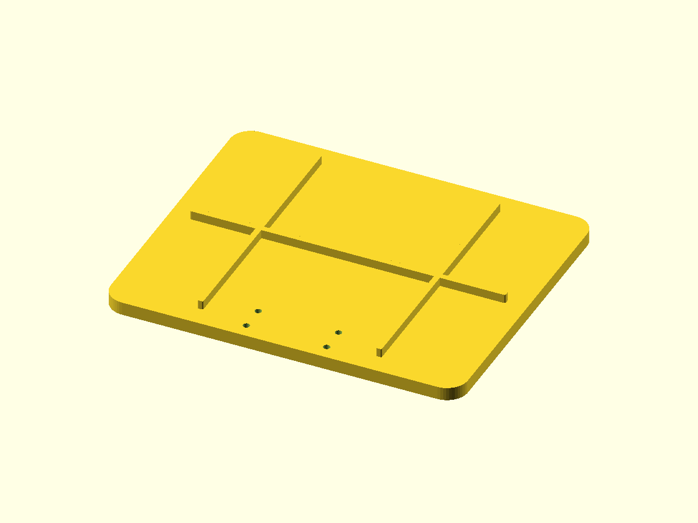

# Wall-Mounted Horizontal Swivel Table

A fully 3D-printable wall-mounted table that swivels horizontally on a vertical pivot post — like a door that folds flat against the wall when not in use and swings 90° out when in use. Designed for the **Bambu P2S** (256 × 256 × 256 mm build plate), but printable on any FDM printer with a 256 × 256 mm or larger bed.

---

## Renders

| Deployed (in use) | Stored (flat against wall) |
|:-----------------:|:--------------------------:|
|  |  |

---

## Design Overview

| Colour in render | Part | Role |
|:---:|:---|:---|
| 🔵 Blue | Wall bracket | Mounts to wall; provides vertical pivot post |
| 🟠 Orange | Swivel arm | Rotates around pivot post; carries table top |
| 🟤 Wood/Wheat | Table top | 240 × 200 mm surface with stiffening ribs |
| ⬜ Gray | Pivot cap | Covers bolt head; decorative |
| 🔴 Terracotta | Support leg | Optional fold-down floor brace |
| 🪨 Slate | Leg bracket | Attaches support leg to arm underside |

The **pivot mechanism** is a 26 mm diameter PETG post (integral to the wall bracket) with a concentric M8 bore. The swivel arm's socket slides over the post. Friction is set by tightening an M8 nylon-insert lock nut — tighten for more resistance, loosen for easier swivel. Once set, the table stays in any swivelled position on its own.

A reinforcing **gusset blends** the socket smoothly into the box-section arm, and the arm is **hollow** (5 mm walls) to save material while maintaining stiffness.

---

## Parts to Print

> **PETG strongly recommended** for all structural parts (wall_bracket, swivel_arm, leg). PLA+ is acceptable but PETG handles heat, humidity, and stress better.

| File | Qty | Material | Perimeters / Walls | Infill | Layer height | Notes |
|:-----|:---:|:--------:|:-------------------:|:------:|:------------:|:------|
| `stl/wall_bracket.stl` | 1 | **PETG** | 5 | 45 % | 0.2 mm | Most critical structural part — print slowly |
| `stl/swivel_arm.stl` | 1 | **PETG** | 5 | 45 % | 0.2 mm | Print on its side (socket bore facing up) |
| `stl/table_top.stl` | 1 | PLA or PETG | 3 | 20 % | 0.2 mm | Ribs face down; no supports needed |
| `stl/pivot_cap.stl` | 1 | PETG | 4 | 30 % | 0.2 mm | Open end up; no supports needed |
| `stl/support_leg.stl` | 1 | PETG | 4 | 30 % | 0.2 mm | Flat on bed; no supports needed |
| `stl/leg_bracket.stl` | 1 | PETG | 4 | 30 % | 0.2 mm | Flat on bed; no supports needed |

### Recommended Bambu Studio settings
- **Support**: None required for any part (all designed support-free in their print orientations)
- **Seam**: Rear (least visible)
- **Gyroid** or **Grid** infill pattern for structural parts

---

## Print Plates (Bambu P2S — 256 × 256 mm)

| Plate | Contents | Preview |
|:------|:---------|:-------:|
| Plate 1 | wall_bracket + pivot_cap + leg_bracket |  |
| Plate 2 | swivel_arm + support_leg |  |
| Plate 3 | table_top |  |

---

## Hardware Required

| Item | Qty | Purpose |
|:-----|:---:|:--------|
| M8 × 110 mm bolt, grade 8.8 (steel or stainless) | 1 | Main pivot pin |
| M8 flat washer | 2 | One above socket, one below bracket |
| M8 nylon-insert lock nut (Nyloc) | 1 | Friction adjustment |
| M5 × 50 mm screws + wall anchors | 4 | Mount bracket to wall (use studs!) |
| M4 × 20 mm screws | 4 | Attach table top to arm |
| M4 hex nuts | 4 | Captured in arm nut traps |
| M4 × 25 mm bolt + nut | 2 | Support leg hinge + 90° stop |
| Optional: M4 × 12 mm self-tapping screws | 2 | Secure pivot cap |

> **Wall mounting tip**: Drive M5 screws directly into wall studs whenever possible. If studs are unavailable, use toggle bolts or concrete/drywall anchors rated for ≥ 25 kg.

---

## Assembly Instructions

1. **Mount wall bracket** — Screw the wall bracket to the wall through the 4 countersunk holes using M5 × 50 mm screws. Position the pivot-post centre at approximately **950–1000 mm from the floor** for a comfortable standing-height table surface.

2. **Slide arm onto post** — Drop the swivel arm's socket straight down over the pivot post. The socket should rotate freely with light friction.

3. **Insert pivot bolt** — Place one M8 washer on top of the socket. Insert the M8 × 110 mm bolt from the top (bolt head sits on washer).

4. **Fit lock nut** — From below the bracket, place the second M8 washer then the nylon lock nut onto the bolt.

5. **Adjust friction** — Tighten the lock nut gradually, testing by swivelling the arm. **Target feel**: the arm stays in any position on its own but moves with a firm push (~8–10 N at the table edge). Re-adjust any time with a spanner.

6. **Fit pivot cap** — Press the pivot cap onto the bolt head (snap fit). Optionally secure with two M4 × 12 mm screws through the cap into the socket.

7. **Attach table top** — Set the table top on the arm flange (holes aligned). Insert 4 × M4 × 20 mm screws from below through the arm into the table; captured M4 hex nuts in the arm nut traps resist rotation.

8. **Install support leg** — Screw the leg bracket to the arm underside with 2 × M4 screws. Thread one M4 × 25 mm bolt through the bracket ears and support leg hinge hole. Use the second M4 bolt through the stop hole to limit the leg to 90°.

9. **Attach a rubber foot** (optional) — Glue a 14 mm adhesive rubber foot into the recess at the tip of the support leg.

---

## Usage

- **Deploy**: Swing the table 90° out from the wall until the support leg rests on the floor.
- **Store**: Fold the support leg up, then swing the table back flush with the wall.
- **Adjust friction** at any time by tightening/loosening the M8 lock nut.
- **Weight rating**: designed for 5+ lbs (≈ 2.3 kg) continuous load at centre of table. Increase load rating by increasing infill on wall_bracket and swivel_arm.

---

## OpenSCAD Source

All geometry lives in [`wall_swivel_table.scad`](wall_swivel_table.scad).

To customise dimensions, open the file and edit the parameter block near the top.  
To export a part, change the `VIEW` variable and run:

```bash
# Preview assembly
openscad wall_swivel_table.scad   # opens GUI

# Export a part as STL (example)
openscad -o wall_bracket.stl -D 'VIEW="wall_bracket"' wall_swivel_table.scad

# Render a PNG (example, requires a display or xvfb-run)
xvfb-run openscad -o assembled.png \
  -D 'VIEW="assembled"' \
  --autocenter --viewall --projection=p \
  --imgsize=1400,1000 --colorscheme=Cornfield \
  wall_swivel_table.scad
```

### `VIEW` values

| Value | Shows |
|:------|:------|
| `"assembled"` | Full assembly — arm deployed 90° from wall |
| `"stored"` | Full assembly — arm folded flat against wall |
| `"wall_bracket"` | Wall bracket only |
| `"swivel_arm"` | Swivel arm only |
| `"table_top"` | Table top only |
| `"pivot_cap"` | Pivot cap only |
| `"support_leg"` | Support leg only |
| `"leg_bracket"` | Leg bracket only |
| `"plate1"` | Print plate 1 layout |
| `"plate2"` | Print plate 2 layout |
| `"plate3"` | Print plate 3 layout |

---

## Bill of Materials Summary

| Category | Item | Source |
|:---------|:-----|:-------|
| Printed parts | 6 parts as listed above | Print yourself |
| Pivot bolt | M8 × 110 mm bolt (gr. 8.8) | Hardware store |
| Pivot nut | M8 Nyloc nut | Hardware store |
| Washers | M8 flat washer × 2 | Hardware store |
| Wall screws | M5 × 50 mm + anchors × 4 | Hardware store |
| Table screws | M4 × 20 mm + M4 nut × 4 | Hardware store |
| Leg hardware | M4 × 25 mm bolt + nut × 2 | Hardware store |

**Estimated print time**: ~12 hours total across 3 plates  
**Estimated material**: ~200–220 g PETG / PLA+
