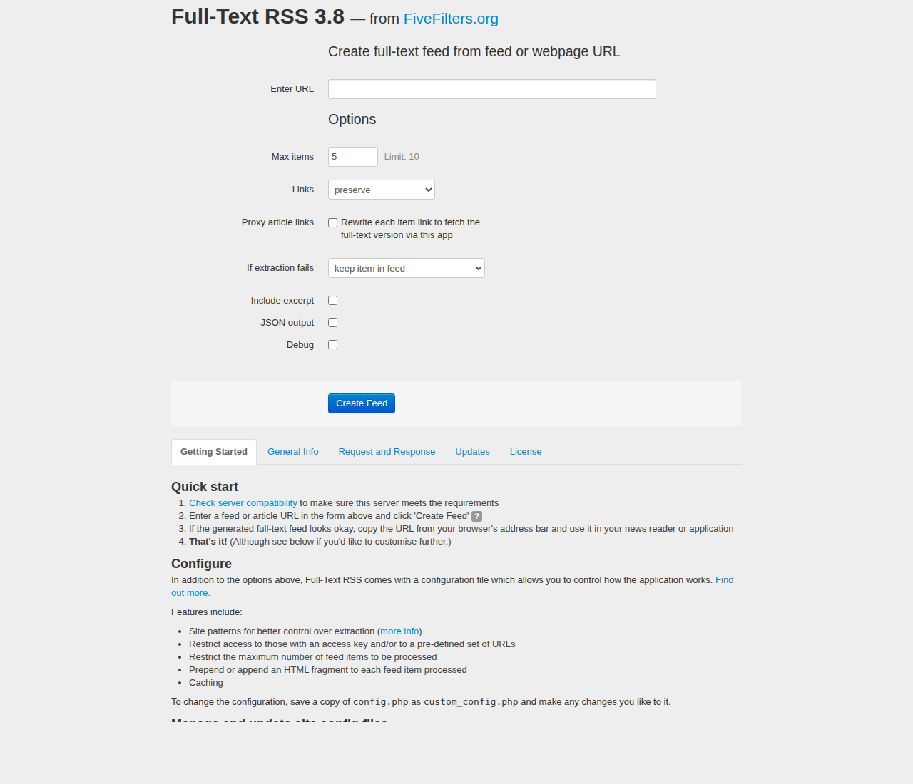

# agent-sandbox

A patched copy of [FiveFilters Full-Text RSS](https://bitbucket.org/fivefilters/full-text-rss)
with a small UI addition: a **"Convert links to footnotes"** checkbox on the
main form (`index.php`). When ticked, the existing `links=footnotes` backend
behaviour is used, so the change is purely client-side and requires no PHP
changes.

## Layout

| Path | What it is |
| --- | --- |
| `full-text-rss/` | Full-Text RSS source, cloned from upstream Bitbucket and patched. |
| `full-text-rss.patch` | Unified diff of every change applied on top of upstream. Currently only `index.php`. |
| `docs/ui-screenshot.png` | Screenshot of the patched UI showing the new checkbox. |
| `Dockerfile` | Container image (modeled on [`heussd/fivefilters-full-text-rss-docker`](https://github.com/heussd/fivefilters-full-text-rss-docker)) that serves the patched FTR. |

## Upstream baseline

Upstream commit: `384d52fd83361ffd6e7f28bd39b322970a015a28`
("Fix PHP 7.2/7.3 incompatibilites") from
<https://bitbucket.org/fivefilters/full-text-rss>.

To re-create / verify the patch:

```sh
git clone https://bitbucket.org/fivefilters/full-text-rss.git /tmp/ftr-upstream
diff -urN --label a/index.php --label b/index.php \
    /tmp/ftr-upstream/index.php full-text-rss/index.php
```

## Building the Docker image

```sh
docker build -t ftr-patched .
docker run --rm -p 8080:80 ftr-patched
# then open http://localhost:8080/
```

## Verifying the feature

The form is a `GET` to `makefulltextfeed.php`, and our checkbox JS rewrites the
`links` field to `footnotes` on submit. So ticking the checkbox is equivalent
to calling:

```sh
curl 'http://localhost:8080/makefulltextfeed.php?url=<ARTICLE_URL>&links=footnotes'
```

Verified against a live BBC News article: with `links=preserve` the body has
inline `<a>` tags only; with `links=footnotes` the inline links are replaced
with `[1]`, `[2]`, … markers and a `<h3>References</h3>` `<ol>` is appended
to the article.

## Screenshot


