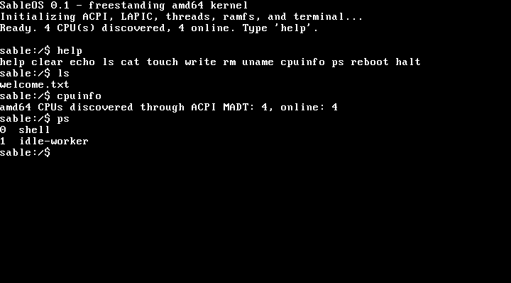

# SableOS

SableOS is a small, bootable, freestanding amd64 operating system. It enters
64-bit long mode, starts all processors reported by ACPI, provides native
kernel threads, a VGA/serial terminal, PS/2 keyboard input, an in-memory
filesystem, and an interactive shell. The build produces a BIOS-bootable ISO
for QEMU, VirtualBox, or physical installation media.



## Build and run

On Debian or Ubuntu, install the required tools:

```sh
sudo apt install build-essential grub-pc-bin grub-common xorriso mtools \
  qemu-system-x86
```

Build the installation image:

```sh
make iso
```

The resulting image is `build/sableos.iso`. Run it with four virtual CPUs:

```sh
make run
```

For VirtualBox, create an **Other/Unknown (64-bit)** VM, enable I/O APIC, assign
one or more processors, attach `build/sableos.iso` to its optical drive, and
boot from that drive. SableOS runs directly from the ISO; no host operating
system or disk image is required.

## Shell

The shell uses the prompt `sable:/$` and supports:

| Command | Purpose |
| --- | --- |
| `help` | List commands |
| `clear` | Clear the VGA terminal |
| `echo TEXT` | Print text |
| `ls` | List files |
| `cat FILE` | Print a file |
| `touch FILE` | Create an empty file |
| `write FILE TEXT` | Replace a file's contents |
| `rm FILE` | Remove a file |
| `uname` | Show the OS and architecture |
| `cpuinfo` | Show discovered and online processors |
| `ps` | List kernel threads |
| `reboot` | Reboot through the keyboard controller |
| `halt` | Halt the bootstrap processor |

The ramfs holds up to 32 files with 512 bytes per file. It is intentionally
simple and volatile: changes disappear when the VM powers off.

## Architecture

- GRUB Multiboot2 loads the ELF kernel from the generated ISO.
- The bootstrap creates identity-mapped 2 MiB pages for the first 4 GiB and
  enters amd64 long mode.
- ACPI RSDT/MADT parsing discovers processors and the local APIC.
- A low-memory trampoline starts each application processor with INIT/SIPI;
  every processor receives a private stack and reports itself online.
- Kernel threads use independent amd64 stacks and an assembly context switch.
- VGA text mode mirrors output to COM1, while a polled PS/2 driver supplies
  terminal input.
- Ramfs supplies bounded file creation, replacement, lookup, listing, and
  removal without dynamic allocation.

## Tests

```sh
make test             # host unit tests for strings and ramfs
make functional-test  # boots a two-CPU VM and verifies both CPUs and the shell
```

`make functional-test` captures COM1 output and fails unless the kernel boots,
brings both configured processors online, and reaches the shell prompt.

## Source layout

```text
arch/x86_64/  bootstrap, AP trampoline, context switching
grub/         boot menu
include/      kernel interfaces
kernel/       console, CPU, keyboard, threads, ramfs, shell
tests/        host unit and QEMU functional tests
```
