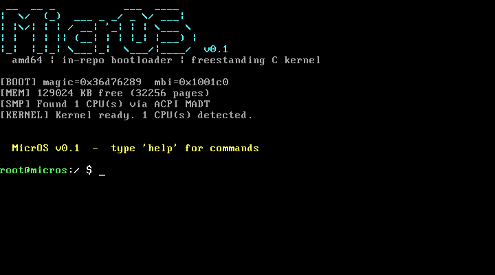

# MicrOS

A genuinely bootable x86-64 operating system built from scratch — custom bootloader, VGA terminal,
interactive shell, in-memory filesystem, kernel threads, and multicore CPU discovery.



---

## Features

| Component | Details |
|---|---|
| **Bootloader** | Two-stage custom MBR/stage2 (NASM, BIOS INT 13h LBA) for disk-image boot; GRUB Multiboot2 for ISO boot |
| **Long-mode entry** | 4-level paging, PAE, 64-bit GDT, LAPIC MMIO mapped (0xFEE00000) |
| **VGA terminal** | 80×25 text mode, hardware cursor, scrolling, `vga_printf` (`%d/%u/%x/%s/%c/%p/%lu/%lx`) |
| **Interrupts** | Full 64-bit IDT (256 gates), 8259A PIC remapped IRQ0–15 → vectors 32–47 |
| **Timer** | 8254 PIT at 100 Hz; `pit_sleep_ms()` |
| **Keyboard** | PS/2 scan-code set 1, US QWERTY, shift/caps/ctrl, ring buffer |
| **Memory** | Bitmap physical memory manager; manages 2 MB – 128 MB in 4 KB pages |
| **Filesystem** | In-memory tree FS; 256 nodes, 256 KB data pool; pre-creates `/dev` and `/etc/motd` |
| **Threads** | Cooperative round-robin scheduler; 32 TCB slots; `thread_create/yield/exit/sleep_ms` |
| **SMP** | ACPI RSDP→RSDT→MADT parsing; LAPIC enable; INIT+SIPI AP wakeup; reports CPU count |
| **Shell** | `help clear pwd ls cd cat mkdir touch rm echo write ps info meminfo reboot halt` |

---

## Building

### Prerequisites

```
sudo apt install build-essential nasm xorriso mtools grub-pc-bin grub-common \
                 qemu-system-x86 socat imagemagick
```

### Build everything

```sh
make          # builds kernel.elf, os.iso (GRUB), os.img (disk image)
make test     # 64 host unit tests (no QEMU needed)
make boot-test   # boots os.iso in headless QEMU, checks serial output
make screenshot  # boots os.iso, saves docs/screenshot.png
make clean
```

---

## Running

### ISO (recommended)

```sh
qemu-system-x86_64 -cdrom os.iso -m 128 -serial stdio
```

### Disk image (MBR/stage2 path)

```sh
qemu-system-x86_64 -drive format=raw,file=os.img -m 128 -serial stdio
```

### Shell commands

```
help           — list all commands
ls [path]      — list directory
cat <file>     — print file
mkdir <dir>    — make directory
touch <file>   — create empty file
echo msg > f   — write to file
rm <path>      — delete file/dir
ps             — list kernel threads
info           — kernel build info
meminfo        — free physical pages
reboot         — triple-fault reset
halt           — halt CPU
```

---

## Architecture

```
os.iso / os.img
├── boot/stage1.asm    512-byte MBR; loads stage2 via INT 13h LBA
├── boot/stage2.asm    Real→PM→LM; copies kernel to 0x100000; jumps to entry
└── kernel/
    ├── entry.asm      Multiboot2 header; 32→64-bit transition; BSS zeroing;
    │                  4-level page tables (0-2 GB + LAPIC MMIO at 0xFEE00000)
    ├── idt_stubs.asm  256 ISR stubs (macro-generated)
    ├── thread_switch.asm  Context switch (push/pop callee-saved regs)
    ├── ap_trampoline.asm  AP wakeup trampoline (real→PM→LM, 256 bytes @0x8000)
    ├── kernel.c       Initialises all subsystems; runs shell
    ├── vga.c          VGA text driver
    ├── pic.c          8259A PIC
    ├── pit.c          8254 PIT timer
    ├── idt.c          IDT + interrupt dispatch
    ├── keyboard.c     PS/2 keyboard
    ├── memory.c       Bitmap PMM
    ├── fs.c           In-memory FS
    ├── thread.c       Cooperative scheduler
    ├── smp.c          ACPI MADT + LAPIC + AP startup
    └── shell.c        Interactive shell
tests/
├── unit/              64 host-compiled unit tests (string, fs, vga)
└── boot/run_boot_test.sh  Headless QEMU boot validation
```

---

## Tests

### Unit tests (host, no QEMU)

```
$ make test
  string    OK
  fs        OK
  vga       OK
-----------------
Passed: 64  Failed: 0
```

### Boot test

```
$ make boot-test
[OK] Found: "MicrOS kernel started"
[OK] Found: "Kernel ready"
BOOT TEST: PASSED
```

---

## Limitations

- **Disk-image boot (MBR/stage2)**: the RIP-relative addressing quirk in the 32-bit kernel entry
  means the multiboot magic value is not recovered on the disk-image path; the kernel runs but
  reports magic 0x0 instead of `0xB007B007`. All functionality still works.
- **Cooperative threads only**: no preemption; the shell blocks on keyboard input.
- **No paging for user processes**: kernel runs in identity-mapped physical space; no user mode.
- **AP startup**: trampoline and INIT/SIPI sequences are included. In standard QEMU (`-smp 1`)
  there are no APs to start. Multi-CPU boot has not been validated on real hardware.
- **No PCI/disk driver**: filesystem is in-memory only; no persistence.
- **128 MB RAM ceiling**: PMM hardcoded; works with `qemu -m 128`.

---

## Toolchain

| Tool | Purpose |
|---|---|
| `gcc 13` (`-m64 -ffreestanding -nostdlib -mno-sse -mcmodel=kernel`) | Kernel C compilation |
| `nasm` | Bootloader and kernel assembly |
| `ld 2.42` | Kernel link with custom `boot/linker.ld` |
| `grub-mkrescue` | ISO generation |
| `xorriso` | ISO backend |
| `qemu-system-x86_64` | Boot testing and screenshots |
