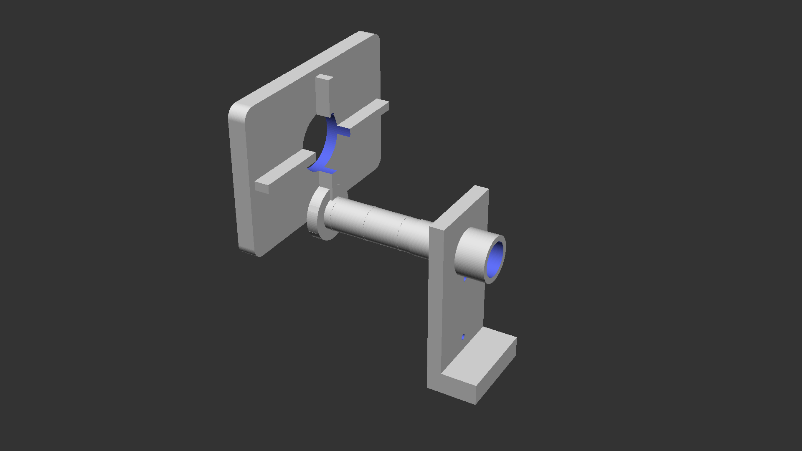
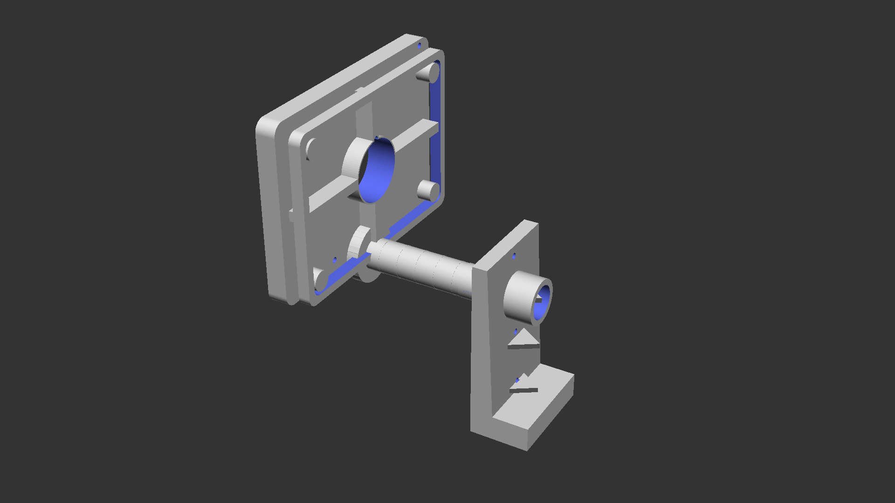
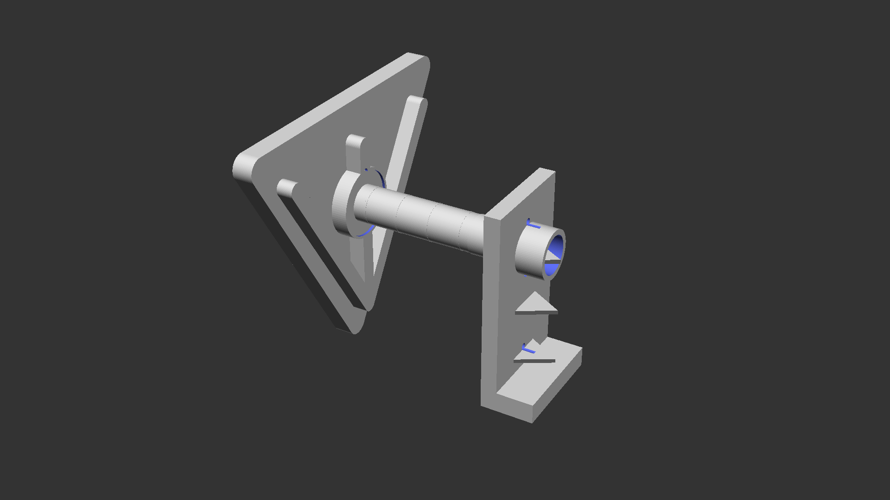
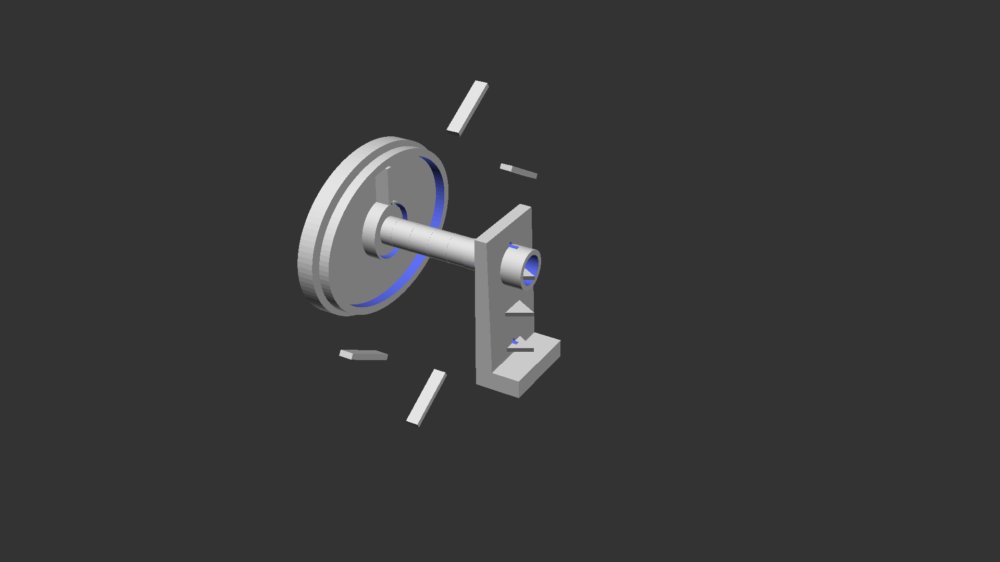
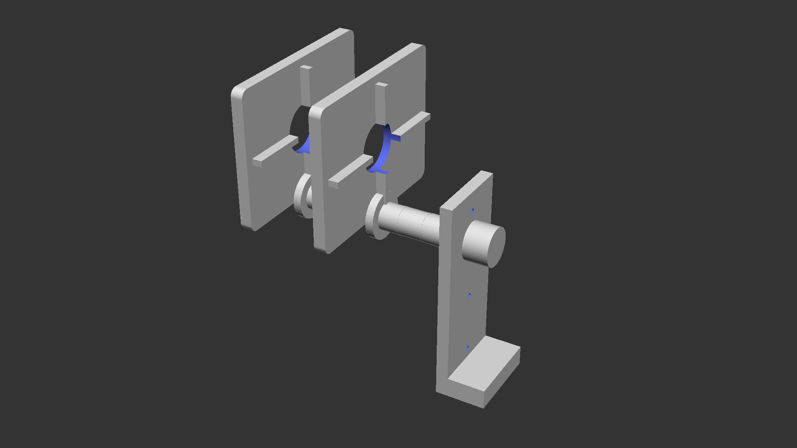
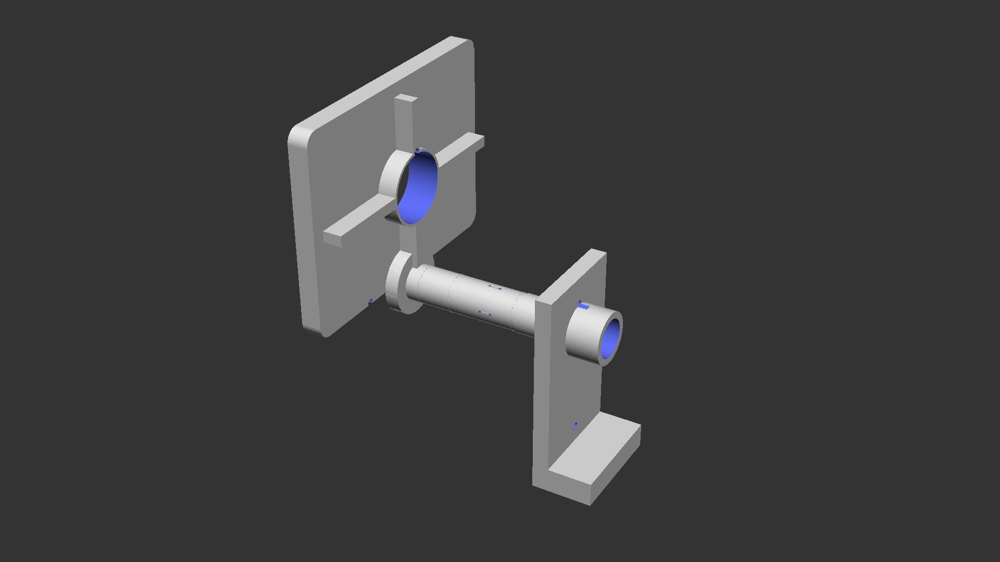
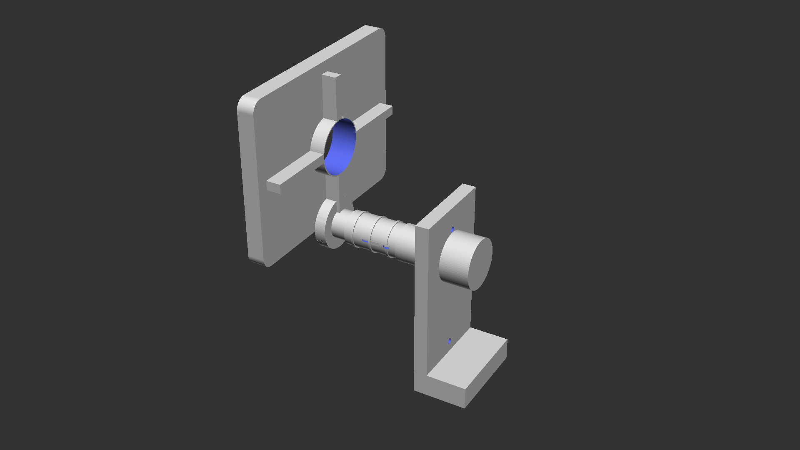
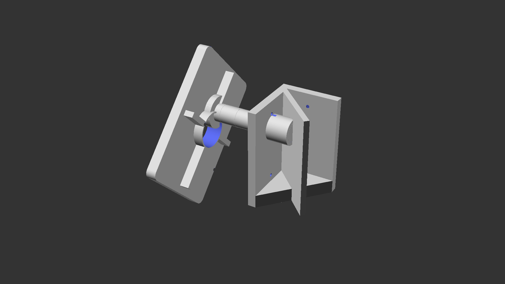
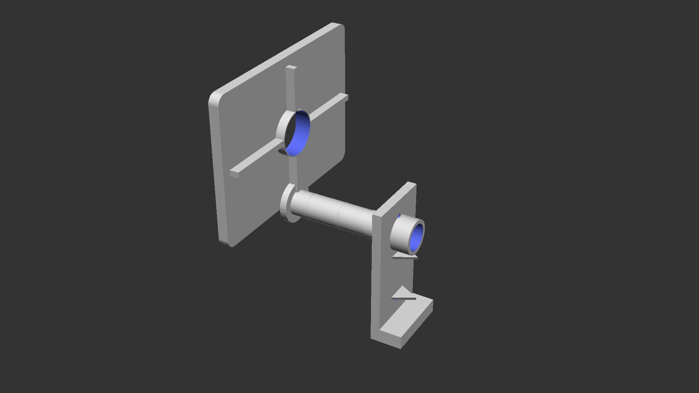

# Wall-Mounted Swivel Table Design Collection

This repository contains 11 different variations of 3D-printable wall-mounted swivel tables. Each design offers unique features and characteristics to suit different needs and preferences.

## Design Overview

All designs are:
- **3D printable** on Bambu P2S (240x256mm build plate)
- **Parametric OpenSCAD** source files included
- **Modular** - parts print separately and assemble
- **Swivel mechanism** - rotates for in/out positioning
- Compatible with **PETG or PLA** (PETG recommended for strength)

---

## Original Design

**Location:** `original/`

The baseline design that inspired all variations. Features balanced dimensions, solid reinforcement, and adjustable friction mechanism.

- **Table Size:** 200mm × 150mm
- **Features:** Friction washers, raised edge, extensive reinforcement
- **Use Case:** General purpose small table

---

## Design 1: Compact

**Location:** `1/`

Reduced dimensions for tight spaces like bedside tables or small workspaces.

- **Table Size:** 150mm × 100mm (25% smaller)
- **Bracket:** 60mm wide, 120mm tall
- **Hardware:** M3 screws (lighter duty)
- **Features:** Simplified design, minimal footprint
- **Use Case:** Nightstand, small shelf, phone holder

---

## Design 2: Large Heavy-Duty

**Location:** `2/`

Larger workspace with enhanced load capacity and stability.

- **Table Size:** 250mm × 180mm (25% larger)
- **Bracket:** 100mm wide, 180mm tall
- **Hardware:** M5 screws, 4 wall mounting points
- **Features:** Thicker construction (15mm bracket, 12mm table), heavy reinforcement
- **Use Case:** Laptop desk, workspace, craft table

---

## Design 3: Triangular

**Location:** `3/`

Unique triangular table surface for aesthetic variation and corner mounting.

- **Table Size:** 220mm base × 190mm depth (triangular)
- **Features:** Y-shaped reinforcement pattern, rounded triangle shape
- **Use Case:** Decorative shelf, corner accent, unique aesthetic

---

## Design 4: Oval/Rounded

**Location:** `4/`

Smooth oval design with no sharp corners for a modern, sleek appearance.

- **Table Size:** 210mm × 160mm (oval)
- **Features:** Radial reinforcement, curved edges, elegant profile
- **Use Case:** Modern decor, safer edges, artistic display

---

## Design 5: Dual-Tier Shelf

**Location:** `5/`

Two-level design for maximum storage in vertical space.

- **Table Size:** 2× shelves at 180mm × 140mm
- **Tier Spacing:** 80mm vertical separation
- **Bracket:** 200mm tall to accommodate both tiers
- **Features:** Double storage, synchronized swivel
- **Use Case:** Books, plants, collectibles, bathroom storage

---

## Design 6: Folding with Locking Positions

**Location:** `6/`

Features mechanical detents that lock at 3 positions (0°, 90°, 180°).

- **Table Size:** 200mm × 150mm
- **Features:** Detent grooves and bumps, locking positions, controlled movement
- **Use Case:** Situations requiring stable locked positions, prevents unwanted rotation

---

## Design 7: Adjustable Height

**Location:** `7/`

Telescoping post design allows height adjustment.

- **Table Size:** 190mm × 145mm
- **Height Range:** 3 adjustable positions (20mm increments)
- **Features:** Outer sleeve and inner sliding post, locking pin mechanism
- **Use Case:** Multi-user household, ergonomic adjustment, flexible workspace

---

## Design 8: Corner-Mount

**Location:** `8/`

L-shaped bracket designed to mount in room corners at 45° angle.

- **Table Size:** 200mm × 150mm
- **Bracket:** L-shaped, mounts to two walls
- **Features:** Corner utilization, diagonal bracing, dual wall mounting
- **Use Case:** Corner spaces, room angles, maximizing unused space

---

## Design 9: Heavy-Duty with Metal Inserts

**Location:** `9/`

Industrial-strength design with cavities for threaded metal inserts.

- **Table Size:** 220mm × 160mm
- **Bracket:** 95mm wide, 16mm thick, 170mm tall
- **Hardware:** M5 threaded inserts, M5 screws
- **Features:** Extra thick construction (14mm table), massive reinforcement, metal insert compatibility
- **Use Case:** Heavy loads (10+ lbs), tool holders, equipment mounting

---

## Design 10: Minimalist Ultra-Thin

**Location:** `10/`

Sleek, thin profile for modern minimalist aesthetics.

- **Table Size:** 180mm × 130mm
- **Thickness:** 6mm table, 8mm bracket (ultra-thin)
- **Hardware:** M3 screws (lightweight)
- **Features:** Minimal material, clean lines, subtle profile
- **Use Case:** Light duty only, decorative, modern design, small items

---

## Comparison Chart

| Design | Table Size (mm) | Wall Bracket | Thickness | Load Capacity | Best For |
|--------|----------------|--------------|-----------|---------------|----------|
| **Original** | 200×150 | 80×150 | 12mm | Medium | General use |
| **1: Compact** | 150×100 | 60×120 | 10mm | Light | Tight spaces |
| **2: Large** | 250×180 | 100×180 | 15mm | Heavy | Workspace |
| **3: Triangle** | 220×190 | 80×150 | 12mm | Medium | Aesthetic |
| **4: Oval** | 210×160 | 80×150 | 12mm | Medium | Modern look |
| **5: Dual-Tier** | 180×140 (×2) | 80×200 | 12mm | Medium | Storage |
| **6: Locking** | 200×150 | 80×150 | 12mm | Medium | Stability |
| **7: Adjustable** | 190×145 | 80×160 | 12mm | Medium | Flexibility |
| **8: Corner** | 200×150 | 90×150 | 12mm | Medium | Corners |
| **9: Heavy-Duty** | 220×160 | 95×170 | 16mm | Very Heavy | Industrial |
| **10: Minimal** | 180×130 | 60×120 | 8mm | Very Light | Decoration |

## Printing Guide

### General Settings
- **Material:** PETG (recommended) or PLA
- **Layer Height:** 0.2mm
- **Infill:** 30-50% (higher for load-bearing parts)
- **Supports:** Required for wall bracket swivel socket
- **Perimeters:** 4-5 walls for strength

### Material Recommendations by Design
- **Designs 1, 10:** PLA acceptable (light duty)
- **Designs 2, 9:** PETG strongly recommended (heavy duty)
- **All others:** PETG recommended, PLA acceptable

### Hardware Required (Typical)
- **Wall Mounting:** M4 or M5 screws + appropriate wall anchors
- **Assembly:** M4 or M5 machine screws + washers
- **Optional:** Lubricant for smooth swivel action

## Assembly Notes

1. Print all parts for your chosen design
2. Remove supports and clean up parts
3. Test-fit swivel post in bearing sleeve
4. Install bearing sleeve in wall bracket
5. Mount bracket securely to wall (find studs for heavy designs)
6. Attach table to swivel post with screws
7. Insert assembled swivel into wall bracket
8. Test rotation and adjust friction if needed

## Customization

All designs are parametric OpenSCAD files. You can modify:
- Dimensions (width, depth, height)
- Swivel diameter and clearances
- Mounting hole positions and sizes
- Reinforcement patterns
- Material thickness

## Safety Notes

⚠️ **Important:**
- Use appropriate wall anchors for your wall type
- Mount to studs when possible for heavy-duty designs
- Do not exceed recommended weight capacities
- Regularly check mounting screws for tightness
- Supervise children around swivel mechanisms

## License

All designs are provided as-is for personal use. Feel free to modify and adapt for your needs.

---

**Design Collection Created:** March 2026
**Tool:** OpenSCAD
**Printer:** Bambu P2S (240×256mm)
