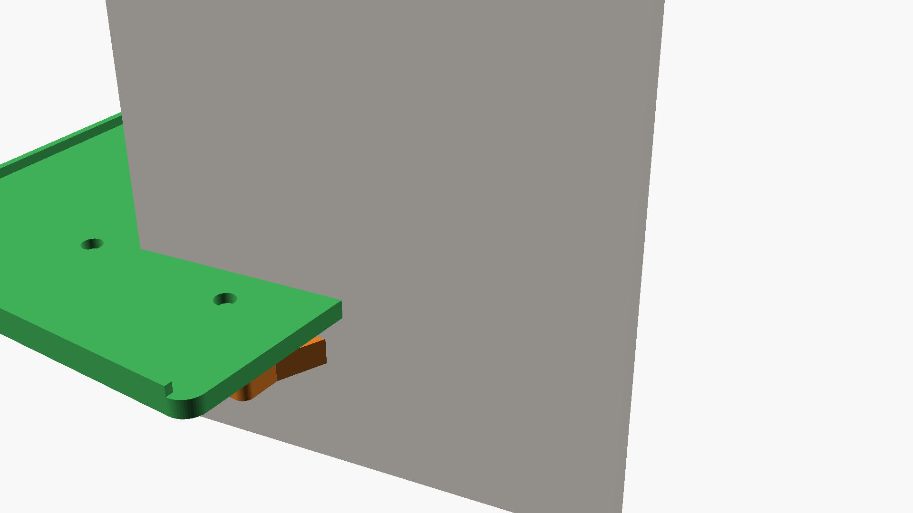
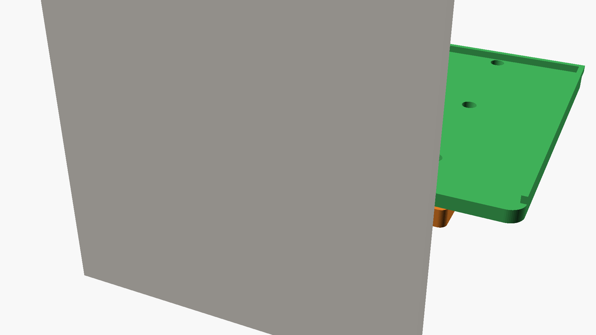
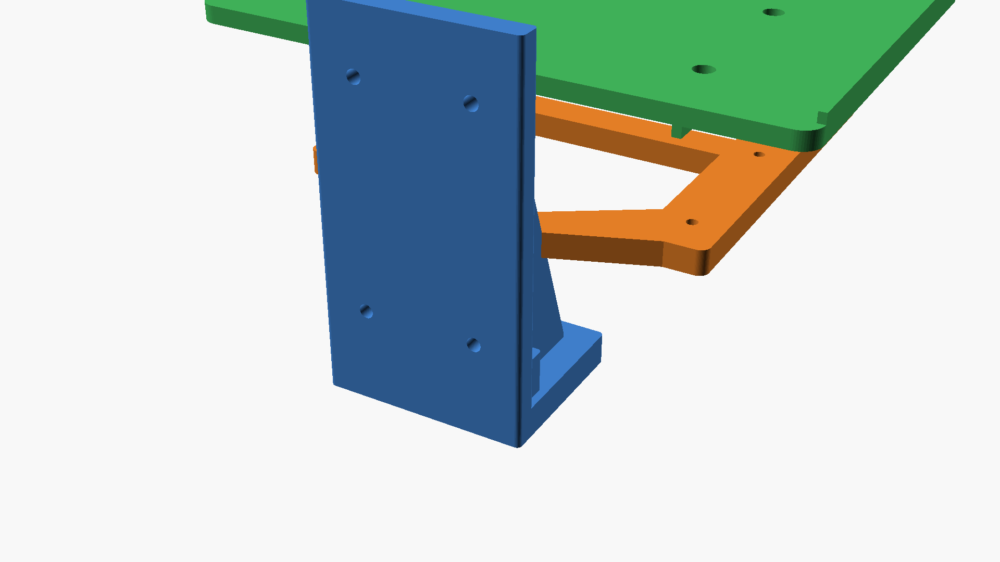
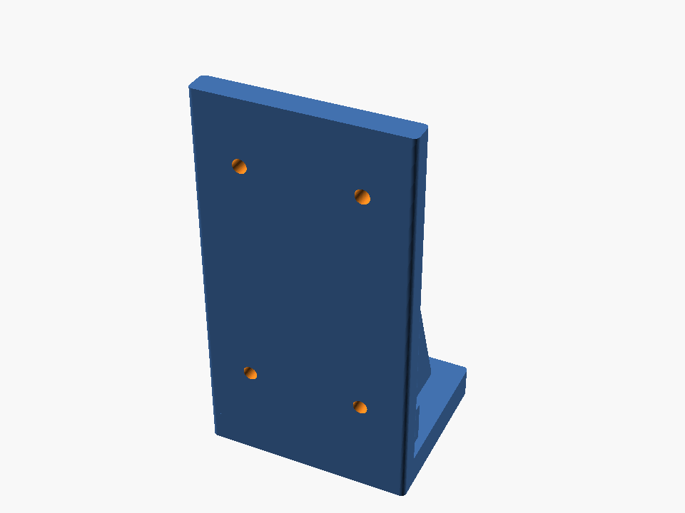
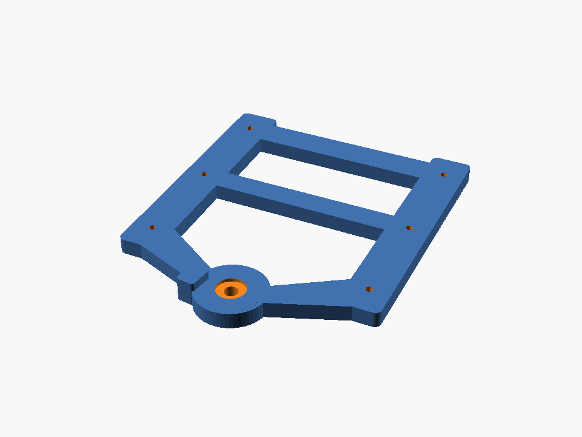
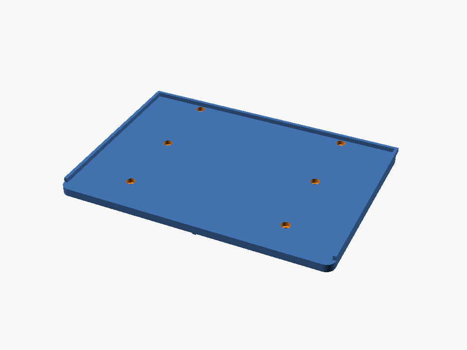

# Wall-Mounted Swivel Table

A 3D-printable small table that mounts to a wall and swivels 90° outward for use. When not needed, it folds flat against the wall to save space. Designed for the **Bambu Lab P2S** (256×256×256mm build volume).

## Renders

### Assembly View (Table Extended ~80°)


### Stowed Position (Flat Against Wall)


### Exploded View (All Parts Separated)


### Individual Parts
| Wall Bracket | Swivel Platform | Table Top |
|:---:|:---:|:---:|
|  |  |  |

## Design Overview

The table consists of **3 printed parts** plus standard hardware:

1. **Wall Bracket** (blue) — L-shaped bracket that screws into the wall. Features triangular gussets for strength and a raised pivot boss.
2. **Swivel Platform** (orange) — Two-arm platform that rotates on the pivot bolt. Includes cross-braces for rigidity and a rotation stop tab.
3. **Table Top** (green) — Flat surface with raised edge lips on 3 sides (prevents items from sliding off) and structural ribs underneath.

### Key Features
- **Swivel range:** 0° (stowed flat against wall) to ~90° (fully extended)
- **Table surface:** 240mm × 170mm (~9.4" × 6.7") — enough for a phone, drink, book, or small plate
- **Weight capacity:** Designed to hold 5+ lbs (2.3+ kg) when mounted to wall studs
- **Adjustable friction:** Tighten the nylock nut on the pivot bolt to set desired swivel resistance
- **Rotation stop:** Built-in stop tab prevents over-rotation past ~95°
- **Supportless printing:** All parts designed to print flat without supports

## Bill of Materials

### Printed Parts (3 plates on Bambu P2S)

| Part | Dimensions (XY footprint) | Print Orientation | Plate |
|------|--------------------------|-------------------|-------|
| Wall Bracket | 80mm × 65mm | Upright (wall plate vertical) | 1 |
| Swivel Platform | ~170mm × 200mm | Flat | 2 |
| Table Top | 240mm × 170mm | Upside-down (smooth top face on bed) | 3 |

### Hardware Required

| Qty | Item | Purpose |
|-----|------|---------|
| 1 | M8×50mm hex bolt | Pivot axle |
| 3 | M8 flat washers (16mm OD) | Under bolt head, between parts, on top |
| 1 | M8 nylon washer | Between bracket shelf and platform (friction control) |
| 1 | M8 nylock nut | Secures pivot, adjustable friction |
| 4 | #10 × 2.5" wood screws **or** wall anchors | Mount bracket to wall |
| 6 | M4×20mm socket head cap screws | Attach table top to platform |
| 6 | M4 nylock nuts | Secure table top bolts |

## Print Settings

| Setting | Recommended Value |
|---------|-------------------|
| Material | **PETG** (preferred) or PLA |
| Layer Height | 0.2mm |
| Infill | 50%+ (gyroid or grid) |
| Wall/Perimeters | 4 minimum |
| Top/Bottom Layers | 5 minimum |
| Supports | None needed |

> **Note:** PETG is recommended for better layer adhesion and heat resistance, especially for the wall bracket and swivel platform which bear load. PLA works for lighter use.

## Assembly Instructions

### Step 1: Mount Wall Bracket
1. Hold the wall bracket against the wall at desired height
2. Mark the 4 screw hole positions
3. **Drill into wall studs** for maximum strength (preferred) or use appropriate wall anchors
4. Secure with 4× #10 wood screws

### Step 2: Assemble Pivot
1. Insert M8 bolt through the bottom of the bracket's shelf hole (bolt head underneath)
2. Place an M8 flat washer, then the **nylon washer** on top of the shelf
3. Lower the swivel platform's hub onto the bolt
4. Add a flat washer on top of the platform
5. Thread on the M8 nylock nut

### Step 3: Adjust Friction
1. Tighten the nylock nut gradually
2. Test the swivel — it should move smoothly with intentional force
3. It should **not** swing freely or drift under its own weight
4. The nylon washer provides controlled, consistent friction

### Step 4: Attach Table Top
1. Align the table top over the swivel platform
2. The 6 mounting holes should align between the table top and platform arms
3. Insert M4 bolts from the top (they recess into counterbores)
4. Secure from below with M4 nylock nuts
5. Tighten firmly — these should not come loose

## Customization

The OpenSCAD file (`wall_swivel_table.scad`) is fully parametric. Key parameters you can adjust:

| Parameter | Default | Description |
|-----------|---------|-------------|
| `table_width` | 240mm | Table surface width |
| `table_depth` | 170mm | Table surface depth (from wall) |
| `table_thick` | 7mm | Table surface thickness |
| `wb_height` | 150mm | Wall bracket height |
| `wb_shelf_dep` | 65mm | How far bracket shelf extends from wall |
| `arm_gap` | 140mm | Distance between platform support arms |
| `swing_angle` | 80° | Display angle for assembly preview |

### Rendering Individual Parts
To export individual STLs from the command line:
```bash
# Wall bracket
openscad -o wall_bracket.stl -D 'render_mode="wall_bracket"' wall_swivel_table.scad

# Swivel platform
openscad -o swivel_platform.stl -D 'render_mode="swivel_platform"' wall_swivel_table.scad

# Table top
openscad -o table_top.stl -D 'render_mode="table_top"' wall_swivel_table.scad

# Assembly preview image
openscad -o assembly.png --imgsize=1920,1080 --autocenter --viewall wall_swivel_table.scad
```

## File Structure

```
├── wall_swivel_table.scad   # Main OpenSCAD source file (parametric)
├── stl/
│   ├── wall_bracket.stl     # Ready-to-print wall bracket
│   ├── swivel_platform.stl  # Ready-to-print swivel platform
│   └── table_top.stl        # Ready-to-print table top
├── renders/
│   ├── assembly_view.png    # Main assembly render
│   ├── assembly_front.png   # Front 3/4 view
│   ├── stowed_view.png      # Table folded against wall
│   ├── exploded_view.png    # Exploded view of all parts
│   ├── wall_bracket.png     # Individual part render
│   ├── swivel_platform.png  # Individual part render
│   └── table_top.png        # Individual part render
└── README.md                # This file
```

## Design Notes

- **Load path:** Weight on the table transfers through the platform arms → down through the pivot bolt → into the bracket's horizontal shelf → through the gussets → into the wall. The gussets are critical for transferring the cantilever load.
- **Pivot design:** The M8 bolt + nylon washer system provides adjustable friction. Unlike a printed friction fit, this won't wear out and can be re-tightened over time.
- **Rotation stop:** A small tab on the swivel platform contacts a block on the wall bracket at ~95° to prevent over-rotation. This protects the pivot from excessive stress.
- **Table ribs:** The underside of the table top has 5 cross-ribs, 2 longitudinal ribs (aligned with the platform arms), and a center spine. This dramatically increases stiffness without adding much material.
- **Edge lips:** Three sides of the table have a 4mm raised edge to prevent items from sliding off. The wall side is left open for easy cleaning.

## Safety

> ⚠️ **Always mount to wall studs** for maximum hold strength. If studs aren't available, use appropriate wall anchors rated for the expected load.

> ⚠️ **Do not exceed the rated capacity** of your wall mounting hardware. The 3D-printed parts can handle more load than most drywall anchors.

> ⚠️ **Periodically check** the pivot nut tension and wall mounting screws. Re-tighten as needed.
