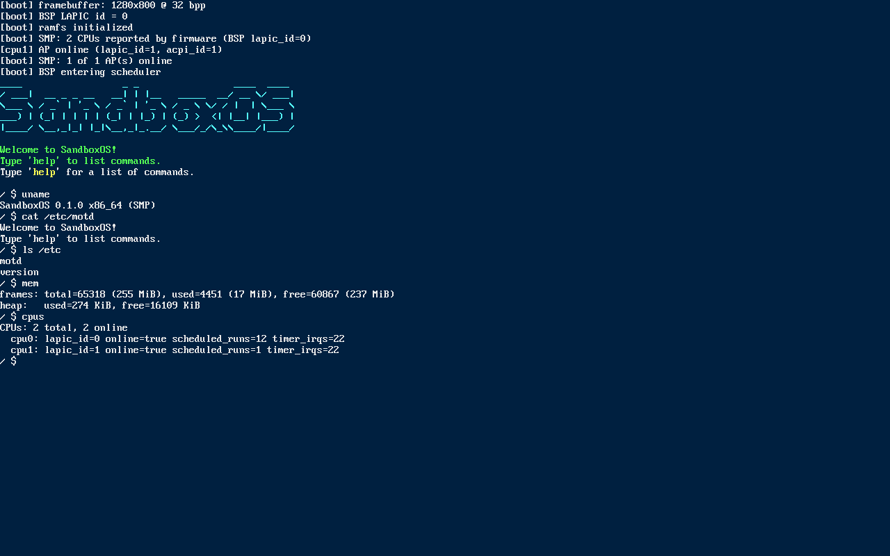
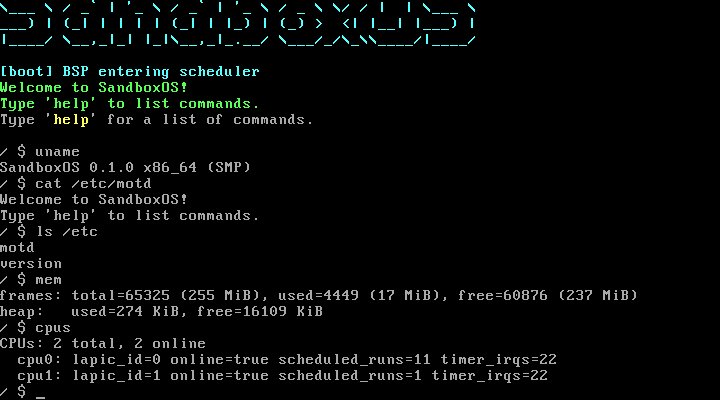

# SandboxOS

A small but complete **x86_64 operating system written from scratch in Rust**.
It boots on BIOS and UEFI PCs (including VirtualBox and QEMU), runs on
multiple CPU cores with a preemptive round-robin scheduler, provides native
kernel threads, an in-memory hierarchical filesystem, a pluggable on-screen
terminal, and a small bash-like interactive shell.

## Screenshots

### Framebuffer console (default)

A 32-bpp pixel framebuffer (Limine) with an 8×16 PSF glyph renderer. Any
resolution the firmware chooses works (the example below is 1280×800). ANSI
colors and cursor control are interpreted by the in-kernel terminal
emulator.



### VGA 80×25 text-mode console

Same kernel, built with `--features textmode`, booted via a Limine entry
that makes no framebuffer request. The kernel disables Bochs VBE, programs
the VGA hardware for BIOS mode 3, re-uploads the font glyphs to plane 2,
and drives the legacy `0xB8000` text buffer. The screenshot is captured at
the native 720×400 text-mode resolution.



Both screenshots were captured automatically by `cargo xtask screenshot`,
which boots each ISO in headless QEMU and dumps the emulated display.

## Features

- **Boot**: Limine v7.x (BIOS **and** UEFI — single hybrid ISO).
- **Higher-half kernel** at `0xffffffff80000000`.
- **Multi-core (SMP)**: all application processors are brought up via Limine's
  MP request; each CPU runs its own IDT, GDT, TSS, LAPIC timer, and pulls from
  a shared run queue.
- **Native kernel threads** with stack-allocated contexts; `switch_context`
  implemented in assembly (`pushfq`/`popfq` + callee-saved regs). Supports
  `spawn`, `yield_now`, `sleep_ticks`, `thread_exit`.
- **Preemptive scheduler** driven by the LAPIC timer; the scheduler lock is
  handed off across context switches to guarantee SMP correctness.
- **Memory**: bitmap physical frame allocator + `linked_list_allocator` heap
  bootstrapped from the Limine memory map.
- **Interrupts**: full CPU-exception handlers (including `#DF` on its own IST
  stack), LAPIC timer vector, PIC remapped and masked.
- **Drivers**: 16550 UART (COM1) polled serial; PS/2 keyboard (scan-code set
  1) polled; 32-bpp framebuffer text console with embedded PSF font; legacy
  VGA 80×25 color text mode (register programming for BIOS mode 3, font
  upload to plane 2, VBE disable).
- **On-screen terminal**: the video console is driven by an in-kernel ANSI
  parser (`kernel/src/term.rs`) that dispatches to one or more
  `TerminalSink` backends, so what you see on screen tracks what the serial
  line sees. Adding a new backend is just an `impl TerminalSink for …`.
- **Filesystem**: `ramfs` (in-memory hierarchical FS) exposed through a small
  VFS, preloaded with `/etc/motd`, `/etc/version`, `/home/user/README`, etc.
- **Shell**: bash-like tokenizer (single + double quotes, backslash escapes,
  `#` comments). Built-ins: `help`, `echo`, `ls`, `cat`, `cd`, `pwd`,
  `mkdir`, `touch`, `write`, `rm`, `mem`, `cpus`, `ps`, `spawn`, `sleep`,
  `uptime`, `uname`, `clear`, `shutdown`, `reboot`.
- **Testing**:
  - Pure-logic code lives in the `shared` crate and is covered by host
    `cargo test` (22 unit tests across shell tokenizer, ramfs, and bitmap
    allocator).
  - An **automated QEMU functional test** (`cargo xtask test`) boots the ISO
    under QEMU, drives the shell over serial, asserts expected output for 15
    checkpoints, and verifies clean shutdown via `isa-debug-exit`.

## Repository layout

```
.
├── boot/                  Limine bootloader binaries + limine.cfg
├── kernel/                no_std kernel crate
│   ├── linker.ld          Higher-half linker script
│   └── src/
│       ├── arch/x86_64/   GDT, IDT, LAPIC, PIC, serial, keyboard,
│       │                  context switch, ports
│       ├── boot.rs        Limine request statics
│       ├── console.rs     Console routing (serial + pluggable video terms)
│       ├── fb.rs          Framebuffer TerminalSink (PSF 8×16 font)
│       ├── fs/            VFS wrapper around shared::ramfs
│       ├── mem/           Frame allocator + kernel heap
│       ├── sched/         Preemptive SMP scheduler
│       ├── shell/         Interactive shell
│       ├── smp.rs         AP entry point
│       ├── term.rs        TerminalSink trait + ANSI/CSI parser
│       ├── vga_text.rs    Legacy VGA 80×25 text-mode TerminalSink
│       └── main.rs        BSP boot + init
├── shared/                no_std + host-testable logic (shell, ramfs, bitmap)
├── xtask/                 Build / ISO / run / test driver
└── rust-toolchain.toml    Pinned nightly
```

## Prerequisites

- Linux host (tested on Ubuntu 22.04)
- Rust nightly (auto-installed via `rust-toolchain.toml`)
- `xorriso`, `qemu-system-x86`, `nasm`, `mtools`, `imagemagick` (for
  `xtask screenshot`), `ovmf` (for UEFI test variants)

Install system deps:

```
sudo apt-get install -y xorriso qemu-system-x86 nasm mtools imagemagick ovmf
```

## Building

```
cargo xtask iso             # build kernel + assemble target/sandboxos.iso
cargo xtask iso-textmode    # same, but with the VGA 80×25 text-mode kernel
```

## Running

```
cargo xtask run             # boot the ISO under QEMU with a window + serial
```

QEMU exposes COM1 on stdio. The shell prompt appears on both the QEMU window
(framebuffer) and your terminal (serial). Type `help` to list commands.

## Screenshots

```
cargo xtask screenshot      # captures docs/img/{framebuffer,vga-text}-console.png
```

Under the hood this boots each variant headlessly under QEMU, waits for the
shell banner, runs a few demo commands, issues `screendump` over the QEMU
monitor socket, and converts the PPM to PNG with ImageMagick.

## Automated tests

```
cargo test -p shared --target x86_64-unknown-linux-gnu      # 22 unit tests
cargo xtask test                                             # QEMU functional test
```

The functional test boots the ISO headlessly, feeds a scripted sequence of
shell commands over COM1, asserts each expected output string appears, and
verifies that `shutdown` exits QEMU via the `isa-debug-exit` device.

## Running on VirtualBox

1. Create a new VM: Type **Other**, Version **Other/Unknown (64-bit)**.
2. Give it ≥ 256 MiB RAM and **4 CPUs** (Settings → System → Processor).
3. Storage → attach `target/sandboxos.iso` to the optical drive.
4. Settings → Serial Ports → Port 1 → enable, Port Mode **Host Pipe**, tick
   *Connect to existing pipe/socket*, path `/tmp/sandboxos.pipe` (Linux/Mac)
   or `\\.\pipe\sandboxos` (Windows). Create the pipe with `socat` /
   `PuTTY` to interact with the shell.
5. Start the VM. The banner and prompt will appear on the VirtualBox display;
   the full shell is usable over the serial pipe.

## Why Rust + Limine

- Rust's `no_std` + ownership gives us a memory-safe kernel without a runtime.
- Limine provides a modern boot protocol with HHDM, SMP, framebuffer, and
  memory map in one call — no legacy real-mode bring-up needed, and the same
  ISO works on both BIOS and UEFI.

## License

Kernel & tooling: MIT (see `LICENSE`). Limine binaries under `boot/limine/`
are BSD 2-Clause (see `boot/limine/LIMINE-LICENSE`). The embedded
`Lat15-VGA16` PSF font from the Debian `console-setup` package is in the
public domain.
