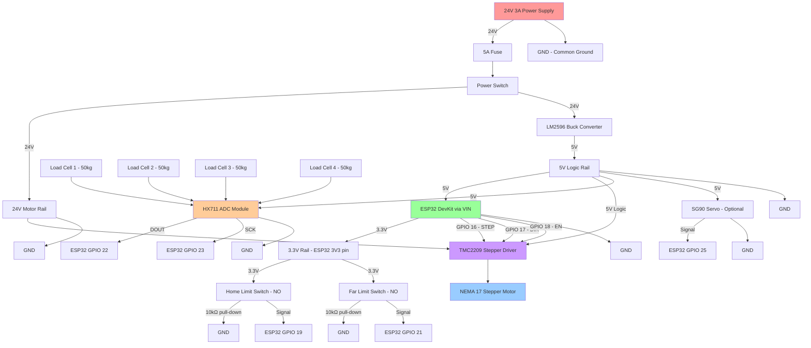

# Phase 4: Electronics & Wiring Diagrams

## System Architecture

The control system uses an ESP32 microcontroller as the central brain, managing stepper motor control, sensor inputs, and state machine logic. All components operate on either 24V (stepper motor), 5V (logic), or 3.3V (ESP32 native) power rails.

## Power Distribution

**Primary Power:** 24V 3A DC power supply (72W)

**Power Rails:**
- **24V Rail**: NEMA 17 stepper motor via TMC2209 driver
- **5V Rail**: Buck converter (LM2596) steps down 24V→5V for logic components
- **3.3V Rail**: ESP32 internal regulator from 5V USB/VIN

## Complete Wiring Diagram (Mermaid)

## Detailed Component Connections

### ESP32 Pinout Assignment

| ESP32 GPIO | Function | Connected To | Signal Type |
|------------|----------|--------------|-------------|
| GPIO 16 | STEP | TMC2209 STEP pin | Digital Output (3.3V) |
| GPIO 17 | DIR | TMC2209 DIR pin | Digital Output (3.3V) |
| GPIO 18 | ENABLE | TMC2209 EN pin | Digital Output (3.3V, active LOW) |
| GPIO 19 | HOME_SWITCH | Home limit switch | Digital Input (pull-down) |
| GPIO 21 | FAR_SWITCH | Far limit switch | Digital Input (pull-down) |
| GPIO 22 | HX711_DOUT | HX711 data output | Digital Input |
| GPIO 23 | HX711_SCK | HX711 clock | Digital Output |
| GPIO 25 | SERVO_PWM | SG90 servo signal (optional) | PWM Output |
| GND | Ground | Common ground | Ground |
| VIN (5V) | Power input | Buck converter 5V output | Power |
| 3V3 | 3.3V output | Limit switch pull-ups | Power |

### TMC2209 Stepper Driver Connections

**Power:**
- VIN: 24V motor rail
- GND: Common ground
- VM: Internal (connects VIN to motor supply)

**Motor (NEMA 17):**
- A1, A2: Motor coil A (red/blue wires)
- B1, B2: Motor coil B (green/black wires)

**Logic (5V rail powers driver logic):**
- VIO: 5V logic voltage
- GND: Common ground

**Control Signals (from ESP32):**
- STEP: GPIO 16 (pulse for each microstep)
- DIR: GPIO 17 (HIGH = forward, LOW = reverse)
- EN: GPIO 18 (LOW = enabled, HIGH = disabled/sleep mode)

**UART Configuration (optional, for advanced features):**
- TX: Not connected (or to ESP32 RX2 for diagnostics)
- RX: Not connected (or to ESP32 TX2 for current control)
- For basic operation: use standalone mode (MS1/MS2 pins for microstepping)

**Microstepping Configuration (standalone mode):**
- MS1: Pull to GND (via 10kΩ resistor)
- MS2: Pull to VIO (via 10kΩ resistor)
- This sets 1/16 microstepping (3200 steps/rev on 200-step motor)

### Load Cell Wiring (HX711 Module)

**Load Cell Configuration: Full-Bridge (4× 50kg half-bridge cells in parallel)**

Each load cell has 4 wires:
- E+ (Red): Excitation positive
- E- (Black): Excitation negative
- S+ (White): Signal positive
- S- (Green): Signal negative

**Parallel Wiring for 4 Load Cells:**

All E+ wires → HX711 E+
All E- wires → HX711 E-
All S+ wires → HX711 A+
All S- wires → HX711 A-

**HX711 to ESP32:**
- VCC: 5V rail
- GND: Common ground
- DT (DOUT): ESP32 GPIO 22
- SCK: ESP32 GPIO 23

**Calibration Factor:**
- Typical: ~20-25 per gram (varies by load cell)
- Calibration procedure in firmware (see Phase 5)

### Limit Switch Connections

**Home Switch (Motor End):**
- COM: 3.3V from ESP32
- NO (Normally Open): ESP32 GPIO 19
- 10kΩ pull-down resistor between GPIO 19 and GND

**Far Switch (Idler End):**
- COM: 3.3V from ESP32
- NO (Normally Open): ESP32 GPIO 21
- 10kΩ pull-down resistor between GPIO 21 and GND

**Logic:**
- Switch open (carriage not at limit): GPIO reads LOW (0V via pull-down)
- Switch closed (carriage at limit): GPIO reads HIGH (3.3V)

**Debouncing:**
- 100nF ceramic capacitor across each switch (COM to NO)
- Software debouncing in firmware (50ms delay)

### Optional Servo Connection (Motorized Rake Tilt)

**SG90 Servo:**
- VCC (Red): 5V rail
- GND (Brown): Common ground
- Signal (Orange): ESP32 GPIO 25 (PWM)

**PWM Settings:**
- Frequency: 50Hz (20ms period)
- 0°: 1ms pulse width (5% duty cycle)
- 90°: 1.5ms pulse width (7.5% duty cycle)
- 180°: 2ms pulse width (10% duty cycle)

**Rake Angles:**
- 15° (sifting): ~1.2ms pulse
- 45° (dumping): ~1.6ms pulse

---

## Physical Wiring Best Practices

### Wire Gauge Selection

| Circuit | Gauge | Color Code | Max Current |
|---------|-------|------------|-------------|
| 24V Motor Power | 18 AWG | Red/Black | 3A |
| 5V Logic Power | 20 AWG | Red/Black | 2A |
| 3.3V Signals | 22-24 AWG | Multi-color | 0.5A |
| Stepper Motor Coils | 20 AWG | Red/Blue/Green/Black | 1.5A per coil |
| Load Cell Signals | 22 AWG | Red/Black/White/Green | <10mA |

### Cable Management

**Fixed Wiring (frame-mounted components):**
- Use cable ties to secure wires to 2020 extrusion slots
- Group power and signal wires separately (reduces EMI)
- Label all connections with heat-shrink labels

**Moving Wiring (carriage-mounted):**
- Use cable carrier chain (optional but recommended)
- Minimum bend radius: 10× cable diameter
- Secure wires to carriage cable clips (see gantry-carriage.scad)
- Strain relief at motor connector (prevent wire fatigue)

### Grounding Strategy

**Single-Point Ground:**
- All ground connections return to power supply GND terminal
- Prevents ground loops (reduces noise in load cell readings)
- ESP32 GND, buck converter GND, and motor GND all connect at PSU

**Shielding:**
- Twist load cell signal wires (reduces noise pickup)
- Keep stepper motor wires separate from load cell wires (minimum 50mm spacing)
- Optional: Use shielded cable for load cells in high-EMI environments

---

## Power Budget Analysis

### 24V Rail Consumption

| Component | Current (A) | Power (W) | Duty Cycle | Avg Power (W) |
|-----------|-------------|-----------|------------|---------------|
| NEMA 17 Stepper (peak) | 1.5 | 36 | 20% (cleaning) | 7.2 |
| NEMA 17 Stepper (idle) | 0.3 | 7.2 | 80% (idle) | 5.8 |
| Buck Converter Loss | 0.1 | 2.4 | 100% | 2.4 |
| **Total 24V Rail** | - | - | - | **15.4 W** |

### 5V Rail Consumption

| Component | Current (mA) | Power (W) |
|-----------|--------------|-----------|
| ESP32 (WiFi disabled) | 160 | 0.8 |
| TMC2209 Logic | 50 | 0.25 |
| HX711 Module | 10 | 0.05 |
| SG90 Servo (idle) | 10 | 0.05 |
| SG90 Servo (moving) | 500 | 2.5 |
| **Total 5V Rail** | 730 (peak) | **3.65 W (peak)** |

### Total System Power

- **Idle Power**: ~6.1 W (stepper holding, no cleaning)
- **Active Power**: ~18.4 W (cleaning cycle with servo)
- **Average Power**: ~7.5 W (based on 5-minute cleaning cycle per hour)

**Monthly Energy Cost:**
- 7.5W × 24h × 30 days = 5.4 kWh/month
- At $0.12/kWh: **$0.65/month** in electricity

**Power Supply Headroom:**
- Available: 72W
- Peak usage: 18.4W
- Margin: **74% headroom** (safe for component aging)

---

## Safety & Protection

### Overcurrent Protection

**Fuse:** 5A fast-blow in line with 24V supply
- Protects against motor stall or short circuit
- Blows in <100ms at 7.5A (150% overload)

**Motor Current Limiting (TMC2209):**
- Set via VREF pin (or UART)
- Formula: I_max = V_REF / (8 × R_sense)
- Default R_sense = 0.11Ω on TMC2209
- For 1.5A motor: V_REF = 1.32V
- Adjust trimmer potentiometer on TMC2209 while measuring V_REF with multimeter

### ESD Protection

**Handling Precautions:**
- Wear anti-static wrist strap during assembly
- Work on anti-static mat
- Touch grounded metal before handling ESP32 or TMC2209

**Circuit Protection:**
- 100nF ceramic capacitors across power pins (already listed in BoM)
- TVS diodes optional (not critical for enclosed system)

### Thermal Management

**TMC2209 Heat Dissipation:**
- Power dissipation: ~3W at 1.5A motor current
- Heatsink: 20×20×10mm aluminum (usually included with driver)
- Thermal compound: Not required (driver has thermal pad)
- Airflow: Passive (natural convection sufficient)
- Monitor: Touch heatsink after 10-minute run (should be warm but not painful to touch)

**ESP32 Thermal:**
- Max operating temp: 85°C junction
- Typical: 40-50°C in this application (well within spec)
- Mounting: Keep away from motor/driver (separate by 100mm minimum)

### Emergency Stop

**Hardware Interlock:**
- Load cell weight spike during cleaning → firmware halts motor immediately
- Response time: <50ms (interrupt-driven, see Phase 5 firmware)

**Manual Stop:**
- Power switch on main panel (instant cutoff)
- Emergency stop button (optional): wire in series with power switch

---

## Wiring Checklist

Before powering on:

- [ ] Verify all ground connections return to common point (power supply GND)
- [ ] Check stepper motor coil connections (A1/A2, B1/B2 correct pairs)
- [ ] Confirm load cell wiring polarity (E+/E-, S+/S-)
- [ ] Test limit switches with multimeter (continuity check)
- [ ] Verify TMC2209 microstepping configuration (MS1/MS2 resistors)
- [ ] Set TMC2209 current limit (V_REF = 1.32V for 1.5A motor)
- [ ] Check power supply voltage (24V ±5%)
- [ ] Measure buck converter output (5V ±0.1V)
- [ ] Verify fuse is installed and correct rating (5A fast-blow)
- [ ] Ensure no short circuits between 24V, 5V, 3.3V rails (use multimeter)

Initial power-on procedure:

1. Connect ESP32 via USB (for serial debugging)
2. Upload firmware (see Phase 5)
3. Disconnect USB
4. Turn on main power switch
5. Observe ESP32 LED (should blink during boot)
6. Check serial output (homing sequence should start)
7. Verify carriage homes to home switch (moves to left, stops at switch)
8. Test load cell readings (place known weight, verify output)
9. Manually trigger limit switches (verify state change in serial output)

---

## Troubleshooting Common Wiring Issues

### Issue: Stepper motor not moving

**Check:**
- Power to TMC2209 (measure 24V at VIN pin)
- Enable pin LOW (GPIO 18 should output LOW to enable driver)
- STEP pulses on GPIO 16 (use oscilloscope or LED to verify)
- Motor coil connections (use multimeter to verify coil resistance ~3-5Ω per coil)
- TMC2209 current limit (adjust V_REF potentiometer)

### Issue: Load cells read zero or nonsense values

**Check:**
- 5V power to HX711 module
- Ground connection to HX711
- Load cell wire connections (E+/E-/S+/S- correct)
- Serial output during calibration (see firmware debug output)
- Replace HX711 module (common failure point)

### Issue: Limit switches not triggering

**Check:**
- 3.3V at switch COM terminal
- Continuity across switch when pressed (use multimeter)
- Pull-down resistors installed (10kΩ to GND)
- GPIO state in serial output (should toggle when switch pressed)
- Debounce capacitors installed (100nF)

### Issue: ESP32 brown-out resets during motor movement

**Cause:** Voltage drop on 5V rail when motor draws peak current

**Solutions:**
- Add 1000µF electrolytic capacitor across 5V rail (near ESP32)
- Check buck converter output under load (should stay >4.8V)
- Reduce motor current limit on TMC2209
- Upgrade buck converter to higher current rating (5A instead of 3A)

### Issue: TMC2209 heatsink too hot to touch

**Cause:** Motor current limit set too high or poor thermal contact

**Solutions:**
- Verify V_REF setting (should be 1.32V for 1.5A motor, not higher)
- Check heatsink mounting (should be firmly pressed against driver IC)
- Add small fan for active cooling (optional)
- Reduce motor holding current in firmware (see Phase 5)

---

**Next:** See `phase5-firmware-design.md` for state machine logic and production firmware code.
